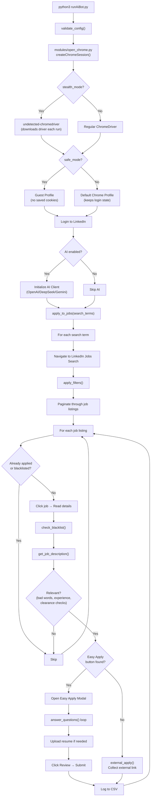
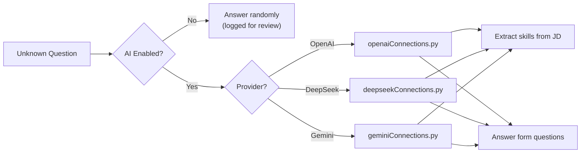

# Auto Job Applier — Complete Architecture & Flow

## Project Structure

```
Auto_job_applier/
├── runAiBot.py          ← 🚀 Main entry point (bot logic, ~1287 lines)
├── app.py               ← 🌐 Flask web UI for viewing applied jobs history
├── config/              ← ⚙️ All user configuration
│   ├── personals.py     ← Name, phone, address, EEO data
│   ├── questions.py     ← Resume path, answer templates, pause settings
│   ├── search.py        ← Search terms, filters, blacklists, experience
│   ├── secrets.py       ← LinkedIn creds, AI API keys, AI provider choice
│   ├── settings.py      ← Bot behavior (stealth, background, click gaps)
│   └── resume.py        ← Resume customization templates
├── modules/
│   ├── open_chrome.py   ← Chrome/ChromeDriver session creation
│   ├── clickers_and_finders.py  ← Selenium click/find/scroll helpers
│   ├── helpers.py       ← Logging, sleep, buffer, utility functions
│   ├── validator.py     ← Config validation at startup
│   ├── ai/
│   │   ├── openaiConnections.py   ← OpenAI API integration
│   │   ├── deepseekConnections.py ← DeepSeek API integration
│   │   ├── geminiConnections.py   ← Gemini API integration
│   │   └── prompts.py             ← AI prompt templates
│   └── resumes/
│       ├── generator.py  ← Resume generation framework
│       └── extractor.py  ← Resume data extraction
├── all excels/           ← CSV logs (applied jobs, failed jobs)
├── all resumes/default/  ← Your resume files
├── logs/                 ← Runtime logs & screenshots
├── templates/index.html  ← Web UI template
└── setup/                ← Setup scripts (Windows/Mac/Linux)
```

---

## Complete Execution Flow



---

## Phase-by-Phase Breakdown

### Phase 1: Startup & Validation
| Step | File | What Happens |
|------|------|-------------|
| 1 | [runAiBot.py](file:///Users/aditi/Documents/AG_workspace/Auto_job_applier/runAiBot.py) | Imports all configs, sets global variables |
| 2 | [modules/validator.py](file:///Users/aditi/Documents/AG_workspace/Auto_job_applier/modules/validator.py) | Validates all config values (types, ranges, formats) |
| 3 | [modules/open_chrome.py](file:///Users/aditi/Documents/AG_workspace/Auto_job_applier/modules/open_chrome.py) | Creates Chrome session with configured mode |

### Phase 2: Login
| Step | File | What Happens |
|------|------|-------------|
| 4 | `runAiBot.py → login_LN()` | Navigates to linkedin.com/login |
| 5 | | Fills credentials from [secrets.py](file:///Users/aditi/Documents/AG_workspace/Auto_job_applier/config/secrets.py) or asks for manual login |
| 6 | | Waits for redirect to /feed/ confirming success |

### Phase 3: Job Search & Filtering
| Step | File | What Happens |
|------|------|-------------|
| 7 | `runAiBot.py → apply_to_jobs()` | Loops through `search_terms` from [search.py](file:///Users/aditi/Documents/AG_workspace/Auto_job_applier/config/search.py) |
| 8 | `→ apply_filters()` | Opens "All filters" modal, selects: date posted, experience level, job type, remote/on-site, salary, etc. |
| 9 | | Clicks "Easy Apply" pill button in top bar |

### Phase 4: Job Evaluation (Per Job)
| Check | Config Source | Logic |
|-------|-------------|-------|
| **Already Applied** | CSV history | Skip if [job_id](file:///Users/aditi/Documents/AG_workspace/Auto_job_applier/runAiBot.py#169-183) exists in history file |
| **Blacklisted Company** | `about_company_bad_words` | Skip + blacklist company for session |
| **Bad Words in Description** | `bad_words` list | Skip if job description contains any |
| **Security Clearance** | `security_clearance` flag | Skip if False and description mentions clearance |
| **Experience Mismatch** | `current_experience` | Skip if required > yours (+ masters bonus) |

### Phase 5: Application (Easy Apply)
| Step | What Happens |
|------|-------------|
| 1 | Click "Easy Apply" button on job card |
| 2 | [answer_questions()](file:///Users/aditi/Documents/AG_workspace/Auto_job_applier/runAiBot.py#459-770) iterates through form fields |
| 3 | **Select dropdowns** → Maps to config answers (gender, location, etc.) |
| 4 | **Radio buttons** → Maps to citizenship, veteran, disability status |
| 5 | **Text inputs** → Maps to experience, salary, name, phone, etc. |
| 6 | **Textareas** → Fills summary, cover letter |
| 7 | **Checkboxes** → Auto-checks acknowledgements |
| 8 | If AI enabled and answer unknown → Query AI provider |
| 9 | If still unknown → Answer randomly (logged for review) |
| 10 | Upload resume if `useNewResume = True` |
| 11 | Click "Review" → "Submit application" |

### Phase 6: Logging & Output
| File | Purpose |
|------|---------|
| `all excels/all_applied_applications_history.csv` | All successfully applied/collected jobs |
| `all excels/all_failed_applications_history.csv` | Failed applications with error reasons |
| `logs/` | Runtime logs + screenshots of failures |

---

## AI Integration Flow



AI is used for two purposes:
1. **Skill extraction** from job descriptions (logged in CSV)
2. **Answering unknown questions** that don't match any config template

---

## Web UI ([app.py](file:///Users/aditi/Documents/AG_workspace/Auto_job_applier/app.py))

A Flask server that reads the CSV files and displays applied jobs history in a searchable/filterable table via [templates/index.html](file:///Users/aditi/Documents/AG_workspace/Auto_job_applier/templates/index.html). Runs on port 5001 (configurable).
